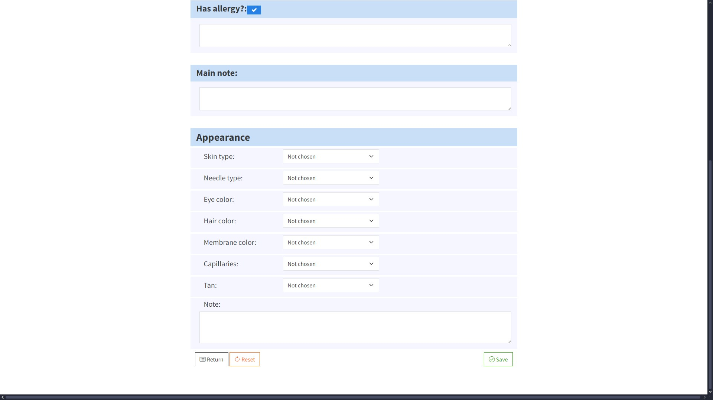

# Client Base Control Web Application

Web application for convinient control over client base, services and materials of the permanent make up business. Final modified version of the application is planned to be used in practice.
The following sections show current database architecture and the most important implemented pages of the application. 

## Features
- CRUD functionality is implemented for Clients together with Appearances, Materials and Procedure Types.
- The application implements a search functionality for most models.
- Dynamic localization of the interface is also implemented.

## Current database architecture

## Pages and functionality showcase
### Home Page

### Clients list page

### Client creation page

### Client details page

### Client deletion page

###  Materials list page

###  Material creation page

###  Search functionality showcase

